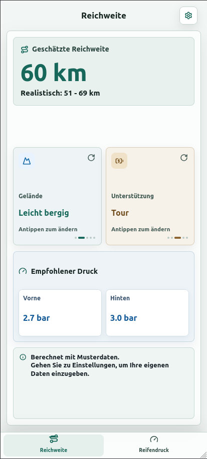
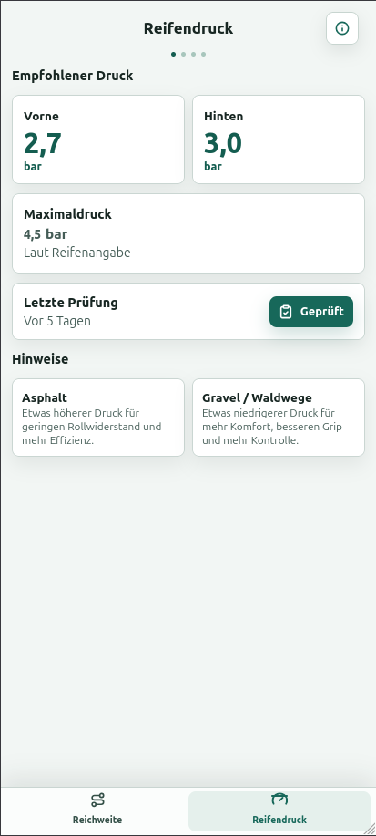
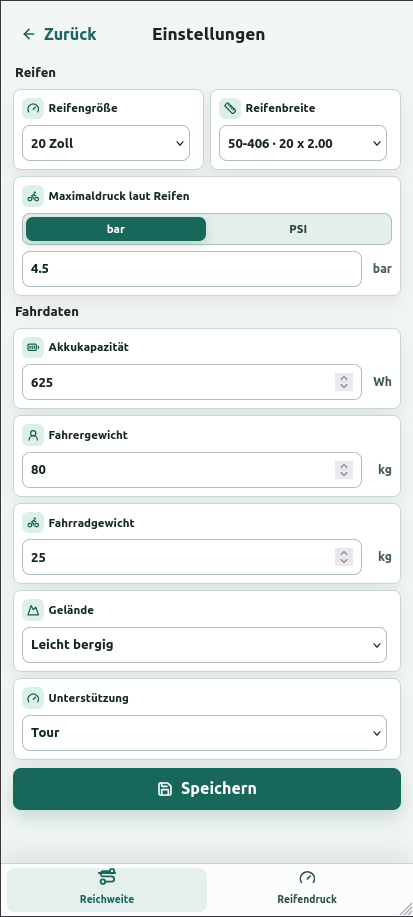

<div align="center">
  
  <h1>E-Bike Akku-Rechner</h1>
  <p>Mobile-first PWA für Reichweitenschätzung und den passenden Reifendruck.</p>

  
  
  
  
  
</div>

## App Preview

The repository opens with a quick visual overview of the current mobile-first
interface. The three views cover the complete primary workflow: estimate range,
check tire pressure, and adjust personal settings.

<table>
  <tr>
    <th>Range overview</th>
    <th>Tire pressure</th>
    <th>Settings</th>
  </tr>
  <tr>
    <td align="center">
      
    </td>
    <td align="center">
      
    </td>
    <td align="center">
      
    </td>
  </tr>
</table>

Die Vorschau zeigt die drei zentralen Ansichten der mobilen PWA: Reichweite,
Reifendruck und Einstellungen. Die Screenshots werden direkt im Repository
versioniert und sind deshalb auch auf GitHub ohne lokale Entwicklungsumgebung
sichtbar.

> **Zwei klare Aufgaben. Eine schnelle mobile Oberfläche.**
> Die App berechnet eine realistische E-Bike-Reichweite und zeigt den empfohlenen Druck für Vorder- und Hinterreifen. Alle Angaben bleiben lokal auf dem Gerät.

<p align="center">
  <a href="#quick-start">Quick Start</a> ·
  <a href="#funktionen">Funktionen</a> ·
  <a href="#developer-guide">Developer Guide</a> ·
  <a href="#schnellstart-deutsch">Deutsch</a>
</p>

## Quick Start

### Für Nutzer

1. App öffnen oder auf Android im Browser über **Zum Startbildschirm hinzufügen** installieren.
2. Beispieldaten bestätigen oder über das Zahnrad eigene Fahrrad- und Fahrdaten speichern.
3. Auf der Reichweiten-Seite **Gelände** und **Unterstützung** antippen, um die Schätzung sofort anzupassen.
4. Im Tab **Reifendruck** den empfohlenen Druck für Vorder- und Hinterreifen ablesen.

Die Beispielrechnung startet mit ungefähr **60 km** und einem realistischen Bereich von **51 bis 69 km**. Das Ergebnis ist eine Orientierung und ersetzt keine Messung unter realen Bedingungen.

### Installation als PWA

Die Anwendung benötigt keinen App-Store und kein Benutzerkonto.

| Gerät | Installation |
| --- | --- |
| Android | Chrome-Menü öffnen und **Zum Startbildschirm hinzufügen** auswählen |
| Desktop | Installationssymbol in der Browser-Adressleiste auswählen, sofern angeboten |
| Entwicklung | `npm install` und danach `npm run dev` ausführen |

Die App funktioniert nach dem ersten Laden auch offline, weil Manifest, Icons und Produktions-Assets über den Service Worker zwischengespeichert werden.

## Funktionen

### Die zwei Hauptbereiche

| Bereich | Was der Nutzer dort erledigt |
| --- | --- |
| **Reichweite** | Reichweite, realistischen Bereich, Gelände und Motorunterstützung sehen und ändern |
| **Reifendruck** | Vorder-/Hinterreifen, Maximaldruck, Einheiten und praktische Hinweise prüfen |

Die Einstellungen sind über das Zahnrad auf der Reichweiten-Seite erreichbar. Es gibt bewusst keine dritte Sammelseite und keine unnötigen Bereiche wie Profile, Wartung oder Feedback.

### Reichweite anpassen

Die beiden großen Schaltflächen sind zyklische Bedienelemente. Jeder Tipp wechselt zur nächsten Option und aktualisiert das Ergebnis direkt:

| Einstellung | Optionen |
| --- | --- |
| Gelände | Flach, Leicht bergig, Bergig, Stark bergig, Extrem bergig |
| Unterstützung | Minimal `0%`, Eco `25%`, Tour `50%`, Sport `75%`, Turbo `100%` |

Bei `0%` Unterstützung zeigt die App eine unbegrenzte Akku-Reichweite an, weil der Motor keinen Akkuverbrauch verursacht.

### Reifendruck

Die Empfehlung wird aus Reifengröße, Reifenbreite, Gesamtgewicht und dem eingestellten Maximaldruck abgeleitet. Die App zeigt bar oder PSI an und überschreitet nie den in den Einstellungen hinterlegten Maximaldruck.

Der Nutzer muss zusätzlich die Angaben auf Reifenflanke, Felge und Hersteller beachten. Der niedrigere Herstellergrenzwert ist immer maßgeblich.

### Sprache

Die Sprache wird automatisch aus der Browser- oder Gerätesprache ermittelt:

- `de`, `de-DE`, `de-AT` und andere `de-*`-Locales verwenden Deutsch.
- Alle anderen Sprachen verwenden Englisch.
- Die Sprache kann sich während der Laufzeit über das Browser-Ereignis `languagechange` aktualisieren.
- Dokumenttitel, `lang`-Attribut und PWA-Manifest werden synchron gehalten.

## Schnellstart (Deutsch)

### Für Nutzer

1. App öffnen oder auf Android über das Browser-Menü zum Startbildschirm hinzufügen.
2. Beispieldaten bestätigen oder über das Zahnrad eigene Werte eingeben.
3. Auf **Gelände** und **Unterstützung** tippen, um die Reichweite direkt anzupassen.
4. Im Tab **Reifendruck** den empfohlenen Druck vorne und hinten ablesen.

Die Standardwerte zeigen ungefähr **60 km** Reichweite und einen realistischen Bereich von **51 bis 69 km**. Die Berechnung ist eine praktische Schätzung und keine GPS- oder Wettervorhersage.

### Datenschutz im Alltag

Es gibt keine Anmeldung, keine Cloud-Synchronisierung und keine externe Datenbank. Einstellungen werden nur im lokalen Browser-Speicher (`localStorage`) des verwendeten Geräts gespeichert.

## Developer Guide

### Voraussetzungen

- Node.js 24 oder kompatible aktuelle Node.js-Version
- npm

### Lokale Entwicklung

```bash
npm install
npm run dev
```

Die Entwicklungsumgebung ist danach normalerweise unter [http://127.0.0.1:5173/](http://127.0.0.1:5173/) erreichbar.

### Verfügbare Skripte

| Befehl | Zweck |
| --- | --- |
| `npm run dev` | Startet den Vite-Entwicklungsserver |
| `npm run build` | Führt TypeScript-Prüfung aus und erstellt den Produktions-Build |
| `npm run preview` | Serviert den Produktions-Build lokal |
| `npm run test` | Startet Vitest im Watch-Modus |
| `npm run test:run` | Führt alle Tests einmal aus |

Vor einer Veröffentlichung:

```bash
npm run test:run
npm run build
```

### Architektur auf einen Blick

```text
Browser / installierte PWA
          |
          v
        App.tsx                 zentraler Zustand und Navigation
          |
          +--> RangeCalculator.tsx       Reichweiten-Board
          |       +--> CycleControlButton.tsx
          |       +--> calculateRange.ts
          |
          +--> TirePressureScreen.tsx    Druck-Detailansicht
          |       +--> calculateTirePressure.ts
          |               +--> data/tireSizes.ts
          |
          +--> Settings.tsx              Eingabe und Speichern
          |       +--> utils/storage.ts
          |
          +--> i18n.ts                   Locale-Erkennung und Übersetzungen
```

### Projektstruktur

```text
.
├── index.html
├── package.json
├── public/
│   ├── icon-192-v2.png
│   ├── icon-512-v2.png
│   ├── icon-v2.svg
│   ├── manifest.de.webmanifest
│   ├── manifest.webmanifest
│   ├── screenshots/
│   │   ├── range-overview.png
│   │   ├── settings.png
│   │   └── tire-pressure.png
│   └── sw.js
└── src/
    ├── App.tsx
    ├── App.test.tsx
    ├── components/
    │   ├── BottomNavigation.tsx
    │   ├── CycleControlButton.tsx
    │   ├── InstallPromptModal.tsx
    │   ├── RangeCalculator.tsx
    │   ├── Settings.tsx
    │   ├── TirePressureScreen.tsx
    │   └── WelcomeModal.tsx
    ├── data/tireSizes.ts
    ├── i18n.ts
    ├── styles/global.css
    ├── types/index.ts
    └── utils/
        ├── calculateRange.ts
        ├── calculateTirePressure.ts
        └── storage.ts
```

### Zuständigkeiten der wichtigsten Dateien

| Datei | Verantwortung |
| --- | --- |
| `src/App.tsx` | Zentraler React-Zustand, Tab-Wechsel, Einstellungen, Modals und Berechnungsergebnisse |
| `src/components/RangeCalculator.tsx` | Haupt-Board mit Reichweite, Umschaltflächen und kompakter Druckanzeige |
| `src/components/TirePressureScreen.tsx` | Detaillierte Reifendruckansicht und „Geprüft“-Aktion |
| `src/components/Settings.tsx` | Eingabe der Akku-, Fahr- und Reifendaten |
| `src/components/CycleControlButton.tsx` | Wiederverwendbare, tastaturbedienbare Zyklus-Schaltfläche |
| `src/utils/calculateRange.ts` | Reine und deterministische Reichweitenformel |
| `src/utils/calculateTirePressure.ts` | Reine Reifendruckberechnung inklusive bar/PSI-Umrechnung |
| `src/data/tireSizes.ts` | Reifengrößen, Druckleitfäden und Gewichtsklassen |
| `src/utils/storage.ts` | `localStorage`, Validierung, Defaults und Umgang mit alten Daten |
| `src/i18n.ts` | Deutsche und englische Texte sowie automatische Locale-Auswahl |
| `src/types/index.ts` | Gemeinsame Typen, Optionen und Standardwerte |
| `src/styles/global.css` | Mobile-first Layout, responsive Größen und Fokuszustände |
| `public/manifest*.webmanifest` | Installationsname, Sprache, Theme-Farben und PWA-Icons |
| `public/screenshots/` | Versionierte UI-Vorschauen für die README und GitHub-Projektseite |
| `public/sw.js` | Offline-App-Shell und Cache-Versionierung |

## Berechnungslogik

### Reichweitenformel (English)

The range formula is stored in:

```text
src/utils/calculateRange.ts
```

`calculateRange(settings)` is a pure function. It does not import React, access the DOM, or read from storage. This makes the business rule easy to test and safe to change in isolation.

```text
range = batteryCapacity / energyConsumptionPerKm
```

At full motor support, the consumption is composed of flat-road and climbing energy:

```text
energyConsumptionPerKm =
  (flatConsumption(totalWeight) + climbingConsumption(terrain, totalWeight))
  * motorShare(assistance)
```

Important implementation values:

| Constant | Current meaning |
| --- | --- |
| `FULL_SUPPORT_FLAT_CONSUMPTION_WH_PER_KM` | `18 Wh/km` at reference weight on flat ground |
| `REFERENCE_WEIGHT_KG` | `105 kg` rider plus bike |
| `FLAT_WEIGHT_INFLUENCE` | `0.3`, mild weight effect on flat consumption |
| `MOTOR_EFFICIENCY` | `0.85` for climbing energy |
| `GRAVITY_M_PER_SECOND_SQUARED` | `9.81 m/s²` |
| `WATT_SECONDS_PER_WATT_HOUR` | `3600` |

Terrain elevation estimates:

| Level | Terrain | Positive elevation |
| ---: | --- | ---: |
| 1 | Flat | `0 m/km` |
| 2 | Slightly hilly | `8 m/km` |
| 3 | Hilly | `20 m/km` |
| 4 | Very hilly | `40 m/km` |
| 5 | Extremely hilly | `65 m/km` |

Motor shares:

| Level | Assistance | Motor share |
| ---: | --- | ---: |
| 1 | Minimal | `0%` |
| 2 | Eco | `25%` |
| 3 | Tour | `50%` |
| 4 | Sport | `75%` |
| 5 | Turbo | `100%` |

The UI adds an orientation range around the calculated value:

```text
minimum = range * 0.85
maximum = range * 1.15
```

Values are rounded to full kilometers. At `0%` assistance, the function returns an explicit unlimited-range result because the motor does not use battery energy. Legacy fields such as battery charge, health, and charge cycles remain readable for storage compatibility but are intentionally ignored by the current formula.

### Reichweitenformel (Deutsch)

Die Formel liegt in:

```text
src/utils/calculateRange.ts
```

Die Funktion `calculateRange(settings)` ist rein und deterministisch. Sie verwendet weder React noch DOM- oder Storage-Zugriffe.

```text
Reichweite = Akkukapazität / Energieverbrauch pro Kilometer
```

Der Verbrauch bei voller Unterstützung setzt sich zusammen aus:

```text
Energieverbrauch pro Kilometer =
  (Flachverbrauch + Steigverbrauch) * Motoranteil
```

Die fünf Gelände- und Unterstützungsstufen sowie die technischen Konstanten sind direkt in `src/utils/calculateRange.ts` dokumentiert. Der sichtbare Realbereich wird mit `0.85` und `1.15` berechnet. Dadurch wird aus dem Standardwert von rund `60 km` der Bereich `51 - 69 km`.

### Formel ändern

1. Konstanten oder Hilfsfunktionen in `src/utils/calculateRange.ts` ändern.
2. `calculateRange(settings)` weiterhin rein und deterministisch halten.
3. Erwartete Werte in `src/utils/calculateRange.test.ts` aktualisieren.
4. Sichtbare UI-Erwartungen in `src/App.test.tsx` prüfen und bei Bedarf anpassen.
5. Tests und Produktions-Build ausführen.

```bash
npm run test:run
npm run build
```

### Reifendruckformel

Die Logik liegt in:

```text
src/utils/calculateTirePressure.ts
src/data/tireSizes.ts
```

Der Ablauf ist tabellenbasiert:

1. Reifengröße anhand von `tireSizeId` suchen.
2. Druckleitfaden anhand der nächstgelegenen Reifenbreite wählen.
3. Gesamtgewicht aus Fahrer- und Fahrradgewicht berechnen.
4. Gewichtsklasse auf Vorder- und Hinterrad anwenden.
5. Ergebnis auf Mindestwerte und den konfigurierten Maximaldruck begrenzen.
6. Bar- und PSI-Werte für die Anzeige bereitstellen.

Der Herstellerwert auf Reifen oder Felge ist immer wichtiger als die App-Empfehlung.

## Qualität und Tests

Die Tests decken die zentralen Nutzerpfade und die reine Berechnungslogik ab:

- Reichweitenberechnung für Gelände und Unterstützung
- unbegrenzte Anzeige bei `0%` Motorunterstützung
- Reifendruckberechnung, Rundung und PSI-Umrechnung
- Speichern und Laden lokaler Einstellungen
- deutsche und englische Locale-Auswahl
- Navigation mit genau den zwei Tabs Reichweite und Reifendruck
- Einstellungen öffnen, Werte speichern und Ergebnis aktualisieren
- PWA-Installationsabfrage auf mobilen Browsern

Tests einmalig ausführen:

```bash
npm run test:run
```

## Designprinzipien

- Mobile-first: Die wichtigste Ansicht passt auf ein Smartphone-Display.
- No-scroll shell: The main views adapt to the available smartphone height instead of making the whole app scroll.
- Kein Seiten-Scrolling: Die Hauptansichten passen sich an die verfügbare Smartphone-Höhe an.
- Zwei Aufgaben: Reichweite und Reifendruck stehen im Mittelpunkt.
- Direkte Interaktion: Gelände und Unterstützung werden über große Buttons geändert.
- Lesbarkeit: Ergebnis, Realbereich und Druckwerte haben klare visuelle Priorität.
- Lokale Daten: Keine Anmeldung und keine unnötige externe Infrastruktur.
- Zugänglichkeit: Semantische Buttons, ARIA-Namen, sichtbare Fokuszustände und Tastaturbedienung.
- Einheitliches Icon-System: UI-Symbole kommen aus `lucide-react`; PWA-Icons liegen unter `public/`.

## Grenzen der Berechnung

- Die Reichweite ist eine Schätzung und keine GPS-, Wetter- oder Streckenprognose.
- Wind, Temperatur, Trittfrequenz, Antriebszustand, Reifenmodell, Untergrund und Gepäck werden nicht vollständig modelliert.
- Der Reifendruck ist eine allgemeine Empfehlung und ersetzt nicht die Angaben von Reifen-, Felgen- oder Fahrradhersteller.

## Lizenz und Projektstatus

Das Projekt ist aktuell als private Anwendung in Entwicklung konfiguriert (`private: true` in `package.json`). Eine öffentliche Lizenz ist daher noch nicht festgelegt.

Für Fragen zur Berechnungslogik oder für Erweiterungen sind `src/utils/calculateRange.ts`, `src/utils/calculateTirePressure.ts` und die zugehörigen Tests die besten Einstiegspunkte.
